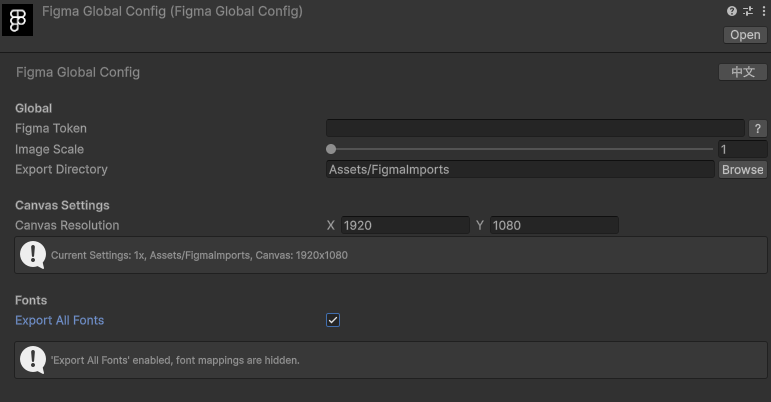
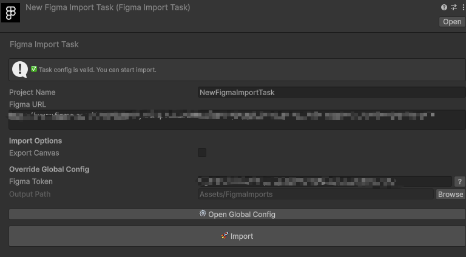
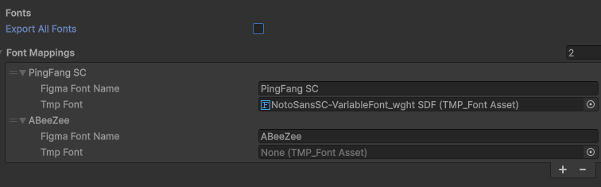
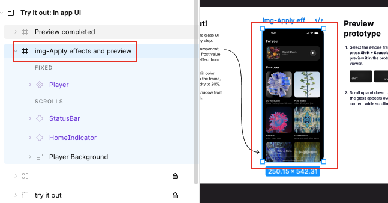
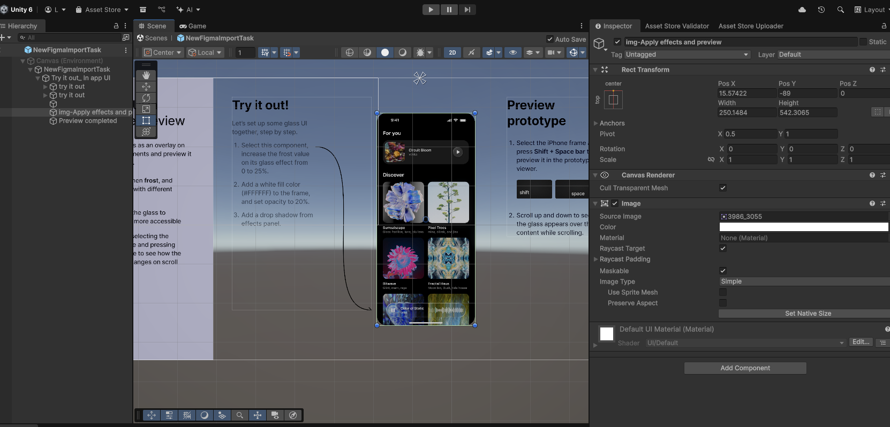

# Figma Unity Importer

> 一个便捷的 Figma 插件，帮助您将 Figma 设计快速导入到 Unity 项目中。

---

## 🚀 快速开始

1. **设置全局配置**
   - 在插件中设置全局配置 `FigmaGlobalConfig`

2. **创建导入任务**
   - 右键点击项目窗口，选择 `Create/Figma/Import Task`

3. **获取 Figma 链接**
   - 在 Figma 中右键点击节点
   - 选择 `Copy/Paste as` / `Copy link to selection`
   - 将链接复制到任务面板中

4. **导入**
   - 点击导入按钮，完成导入

---

## ✨ 主要特性

### 全局资源管理

通过全局配置资源统一管理导入设置。

### 任务资源管理

每个导入任务都有独立的配置选项。

### 🎨 自定义字体导出范围

允许您自定义字体导出范围，灵活控制哪些字体需要导出。

### 🔧 自定义脚本处理流程

支持通过脚本自定义导入后的处理流程，满足个性化需求。

**示例脚本：** `FigmaImportPostprocessorDemo.cs`

### 🏷️ 前缀逻辑支持

通过节点命名前缀，自动识别并处理不同类型的组件：

- **`img-`** - 合并导出为 Image 组件
- **`btn-`** - 合并导出为 Button 组件
- **`ign-`** - 忽略导出

---

## 📝 开发者

**StarAnise Studio**
